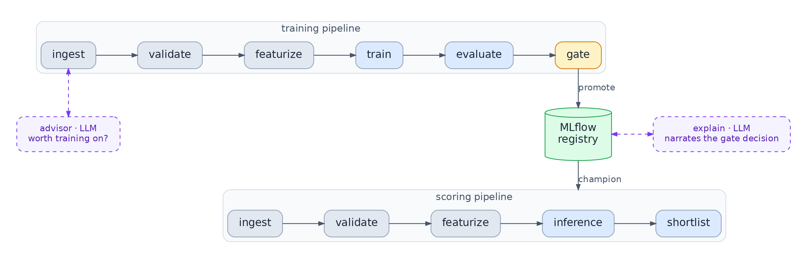
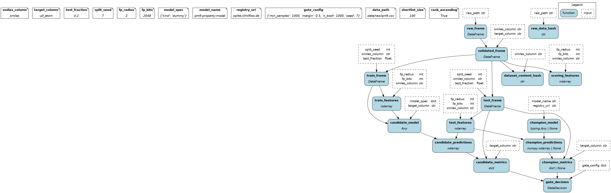
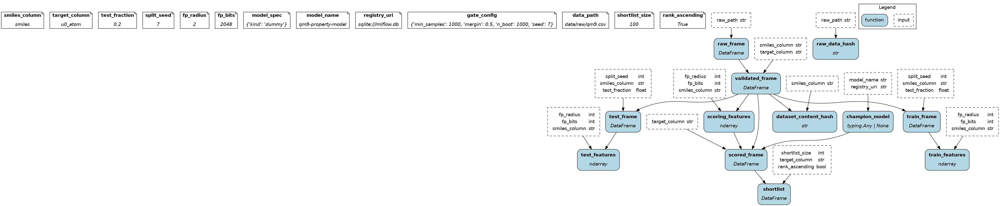

# ml-orchestration-qm9

[](https://github.com/Keboland108/ml-orchestration-qm9/actions/workflows/ci.yml)

Two [Hamilton](https://github.com/dagworks-inc/hamilton) pipelines over the QM9 molecular dataset, package name `molpipe`.
Pipeline #1 trains a candidate model and a deterministic gate decides promotion.
Pipeline #2 scores molecules with the current champion and ranks a shortlist.
MLflow holds the model registry and the run history.
Two LLM agent tasks sit at the edge: they annotate and advise, they never decide.

## Quickstart

Run all commands from the repo root. Paths in the config resolve against the working directory.

```bash
uv sync
uv run invoke data                                  # download QM9 -> data/raw/qm9.csv
uv run invoke chunk                                 # demo chunks: incoming.csv, advisor halves, chunks/chunk_01..03

uv run molpipe train                          # pipeline #1, dummy baseline candidate
uv run molpipe train --model ridge            # pipeline #1, ridge candidate
uv run molpipe score data/raw/incoming.csv    # pipeline #2

uv run pytest                                       # gate + validation + registry tests
```

The agent commands (`explain`, `advise`, `watch`) call the Claude API.
Copy `.env.example` to `.env` and set `ANTHROPIC_API_KEY`.

## CLI

| Command | What it does |
|---|---|
| `train [PATH] [--model KIND]` | Run the training pipeline on a chunk. The gate decides promotion. |
| `score [PATH]` | Predict with the champion and write a ranked `shortlist.csv`. |
| `explain [RUN_ID]` | LLM narrative for a run's gate decision. Logged back onto the run. |
| `advise PATH [--reference PATH]` | LLM retrain recommendation from deterministic data facts. |
| `watch [DIR] [--interval N]` | Poll a landing directory. The advisor screens each new file; training runs only on a positive recommendation. |
| `rollback [--reason TEXT]` | Repoint the champion alias to the previous eligible version. |

Every command accepts `--config FILE`: a JSON object whose keys merge over the QM9 defaults —
column names, registry URI, reference `data_path`, gate thresholds, model spec.
QM9 is just the default config; the engine modules never change.

## Architecture



Only `registry.py` writes to the registry. It writes the audit run for every training run, moves the champion alias on promotion, and performs rollback.
The agents read from the registry and the run history. They write text annotations only. They do not train models, do not make gate decisions, and do not move the alias.

<details>
<summary>The full node-level DAGs, rendered by Hamilton from the code</summary>

| Training pipeline | Scoring pipeline |
|---|---|
|  |  |

</details>

Both pipelines assemble from the same engine modules.
The scoring driver reuses four of its five modules from the training driver; only `scoring.py` is new.

## Promotion, versioning, rollback

- Every training run writes one MLflow run. The run records params (`model_kind`, `raw_data_hash`, `dataset_content_hash`, `config_hash`, `git_sha`), metrics, and a `gate_decision.json` artifact. This happens for promoted and for rejected candidates.
- The gate runs three checks: a minimum sample count, cold-start detection, and a paired-bootstrap confidence interval on the MAE delta against the champion. A passed check means the check found no reason to block promotion.
- On promotion, `registry.py` logs the candidate as a new registered model version. It moves the `champion` alias to that version in a single API call. It sets a `promoted_at` tag on the version.
- A rejected candidate does not change the registry. The rejected candidate exists only in the run history.
- The `rollback` command points the alias at the newest version that has a `promoted_at` tag and no later `rolled_back_at` tag. It sets `rolled_back_at` and `rollback_reason` tags on the demoted version.
- The `champion` alias is the only pointer the scoring pipeline reads. On a fresh registry, the training pipeline continues without a champion on the cold-start path. The scoring pipeline raises an error.

## Tests

`uv run pytest` runs three suites:

- `test_gate.py` — promotion logic: sample floor, cold start, bootstrap margin.
- `test_validation.py` — schema and row checks: missing columns, non-numeric targets, nulls, duplicates, unparseable SMILES.
- `test_registry.py` — rollback against a temporary registry: eligibility skips a version rolled back after promotion.

CI (GitHub Actions) lints with ruff and runs the suite on every push.

## Design notes

**Why Hamilton.** A function is a node, a module is a namespace, and a pipeline is a driver: a module list plus a config dict. Engine code stays plain Python functions with no framework objects, so every node is unit-testable in isolation. The engine modules know nothing about QM9; everything dataset-specific lives in one config dict in `pipelines.py`.

**Why MLflow.** Its registry primitives map directly onto promotion semantics. The alias is the single champion pointer and moves atomically in one call. Version tags form a queryable index (`promoted_at`, `rolled_back_at`). Runs are the append-only audit history. Locally this is one sqlite file; a hosted tracking server is a config change (`registry_uri`), not a code change.

**Where the LLM is — and is not.** The promotion path is deterministic end to end: checks, gate, registry writes. The two agent tasks read state and produce text. The retrain advisor sits between file detection and training to save compute — a redundant chunk never spends a training run. Its output is a recommendation; when training does run, the same deterministic gate still owns promotion.

**Scaling and the third pipeline.** A new pipeline is a new module list and a new config dict; the engine modules do not change — that is how pipeline #2 was built. Hamilton executors move the same DAGs onto Ray or Dask for parallelism. The watcher is a deliberately thin stand-in for a real scheduler or event queue; replacing it touches nothing in the engine.

## Repo layout

```
src/molpipe/
  ingestion.py     read one raw chunk, establish its identity (content hashes)
  validation.py    schema + row checks: bad rows drop, bad files raise
  features.py      Morgan fingerprint featurization
  training.py      fit the configured estimator (dummy | ridge | hist_gbr)
  evaluation.py    candidate vs champion metrics on the same held-out split
  champion.py      registry reads: resolve the champion alias
  gate.py          deterministic promotion decision
  scoring.py       champion predictions + ranked shortlist
  pipelines.py     drivers (module list + config) and run entry points
  registry.py      the only registry writer: audit run, promote, rollback
  agents.py        the LLM edge: explain + advise
  watch.py         landing-directory poller, advisor-screened
  cli.py, main.py  Typer commands and the entry point
tests/             gate, validation, registry rollback
scripts/get_data.py  download QM9, sample chunks
```
